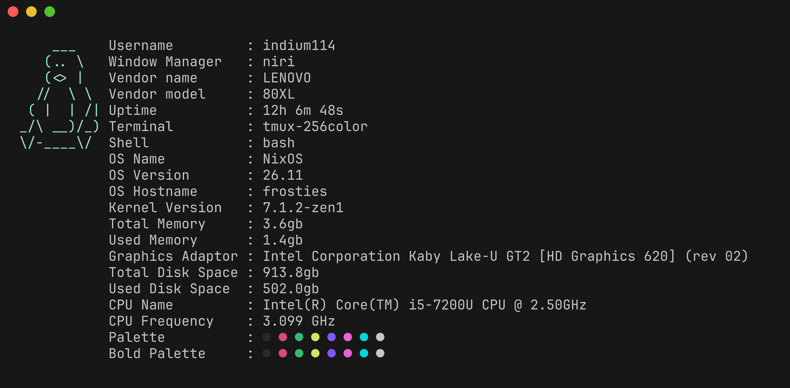

# haal



`haal` is a small system fetch tool written in *Rust* and configured in *Lua*
> the name is the afrikaans word for 'fetch'

## installation

### from the Binary

Go to the *Releases* section on the right, click the latest release, and click the binary for your architecture to download it.

### with [wares](https://github.com/indium114/wares)

add the following to your `config.yaml`, replacing `x86_64` with `arm64` if you're on ARM.

```yaml
wares:
  haal:
    name: haal
    repo: indium114/haal
    asset: "haal_Linux_x86_64"
```

### with cargo

run the following; ensure that `~/.cargo/bin` is in your `$PATH`

```shell
cargo install haal
```

## configuration

the config file is stored at `~/.config/haal/init.lua`, and the ascii logo is stored at `~/.config/haal/logo.txt`.
> to generate a starting config, run `just configure` from the root of this repo.

all of the available stats are used in the default config, but they will also be below for reference.

### user

- `user.name`: your username

### wm

- `wm.name`: the name of the running window manager

### vendor

- `vendor.name`: the vendor of the computer/motherboard
- `vendor.model`: the model of the computer/motherboard

### uptime

- `uptime.uptime`: the uptime of the system (already nicely formatted for you)

### terminal

- `terminal.name`: the name of the running terminal

### shell

- `shell.name`: the name of the default shell

### os

- `os.name`: the name of the os (typically your distro's name)
- `os.version`: the version of the os
- `os.hostname`: your system's hostname
- `os.kernel`: the version of the kernel

### mem

- `mem.total`: total amount of memory in your system, in gigabytes
- `mem.used`: amount of used memory in your system, in gigabytes

### gpu

- `gpu.name`: the name of your graphics card

### disk

- `disk.total`: total size of the root drive, in gigabytes
- `disk.used`: used space on the root drive, in gigabytes

### cpu

- `cpu.name`: the name (and typically frequency) of your cpu
- `cpu.freq`: the frequency of your cpu, in gigahertz

### colour

these are used for changing the colour of text.

- `colour.black("text")`
- `colour.red("text")`
- `colour.green("text")`
- `colour.yellow("text")`
- `colour.blue("text")`
- `colour.purple("text")`
- `colour.cyan("text")`
- `colour.white("text")`

- `colour.boldBlack("text")`
- `colour.boldRed("text")`
- `colour.boldGreen("text")`
- `colour.boldYellow("text")`
- `colour.boldBlue("text")`
- `colour.boldPurple("text")`
- `colour.boldCyan("text")`
- `colour.boldWhite("text")`

## credits

`haal` was heavily inspired by [fetchit](https://codeberg.org/nzuum/fetchit), a really cool, minimal fetch tool written in *c*
